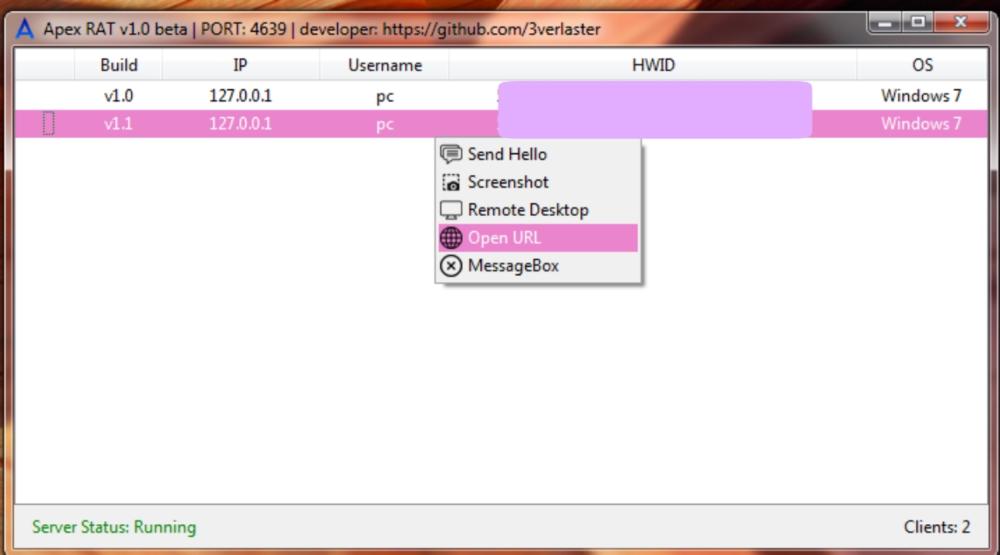

# ◐ &nbsp; Apex RAT &nbsp; ◑

**Remote Administration Tool writted in Python.**

## ⚡️ Usage
1. Install all requirements with `install.bat` file.
2. Configure `connect.apex` and configure `ApexRAT-Client.py`
3. Launch the server with `python ApexRAT-Server.py` or directly via .py file.

## Features
1. Send "Hello, Client" for check connection. [v1.0]
2. Receive client screenshot [v1.0]
3. Remote Desktop Streaming [v1.0]
4. Open URL [v1.0]
5. Summon MessageBox [v1.0]

## Screenshot

