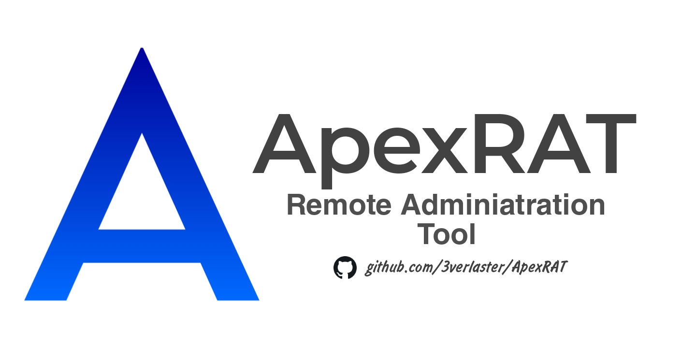
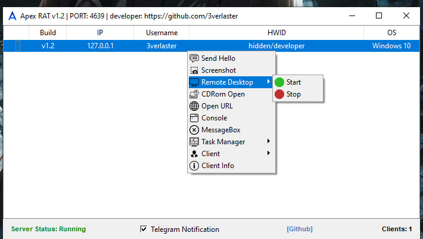
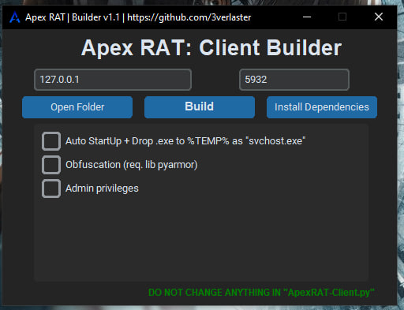

# ◐ &nbsp; Apex RAT &nbsp; ◑

**Remote Administration Tool writted in Python.**

## 🛡 Builder Warning
`pyinstaller==5.11.0`
`pyarmor==7.7.4`

## ⚡️ Usage
1. Install all requirements with `install.bat` file.
2. Configure `connect.apex` and configure `ApexRAT-Client.py`
3. Launch the server with `python ApexRAT-Server.py` or directly via .py file.

## ✈ Telegram Notifications (ApexRAT 1.2)
1. Create a new telegram bot through `https://t.me/BotFather`
2. Insert bot token to `assets/telegram/token_notify.apex`
3. Get Your Chat ID (I've been getting through `https://t.me/chatIDrobot`)
4. Insert your chat id to `assets/telegram/id_notify.apex`
5. Enjoy.

## Features
1. Send "Hello, Client" for check connection. [v1.0]
2. Receive client screenshot [v1.0]
3. Remote Desktop Streaming [v1.0] (v1.1 impoved)
4. Open URL [v1.0]
5. Summon MessageBox [v1.0]
6. Enable/Disable taskmgr.exe [v1.1]

## Screenshot

## Builder

## ApexRAT Changelog

## Apex RAT v1.1:

`[+] Builder(v1.0) - Features: Obfuscation, Auto StartUp, Self copy to %temp% as "svchost.exe". - REQUIRE INSTALLED PYTHON FOR BUILDER WORK`

`[+] Added very important line for correct compiling. (client-side)`

`[+] Button to enable/disable taskmgr.exe (server-side)`

`[+] Periodic Reconnect every 350 seconds.(can be changed) (client-side) - useful for constantly online server.`

`[+] Extra tabs in context menu. [SORTED] (server-side)`

`[/] Optimized code. (both)`

`[/] Ping data fixed. (server-side)`

`[/] Screenshot save bug fixed. (server-side)`

`[/] Improved .bat files. (server-side)`

## Apex RAT v1.2:

`[+] Telegram new client notification. (server-side)`

`[+] Added "Client" menu with ~ "Disconnect", "Delete" buttons. (server-side)`

`[+] Added "[Github]" button. (server-side)`

`[+] Added access to client CMD. Full console with all functions (including $ cd  * through os.chdir)(both)`

`[+] Added access to client CMD. (both)`

`[+] Button to open CD Rom. (server-side)`

`[/] Fixed HWID retrieval. Now gets HWID instead of UUID. (client-side)`

`[/] Optimized sending/receiving data. (both)`

`[/] Fixed reconnection spam, now is 5 seconds. (client-side)`

`[/] Fixed pyinstaller, pyarmor versions to install in b_install.bat (server-side)`

`[*] Changed labels font.`

## Builder Changelog

## Builder v1.1:

`[+] Button to request administrator rights. (Run as admin)`
